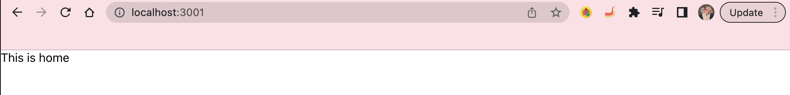
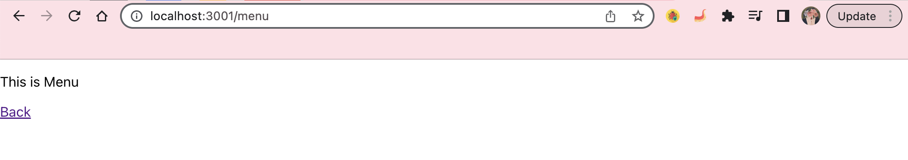
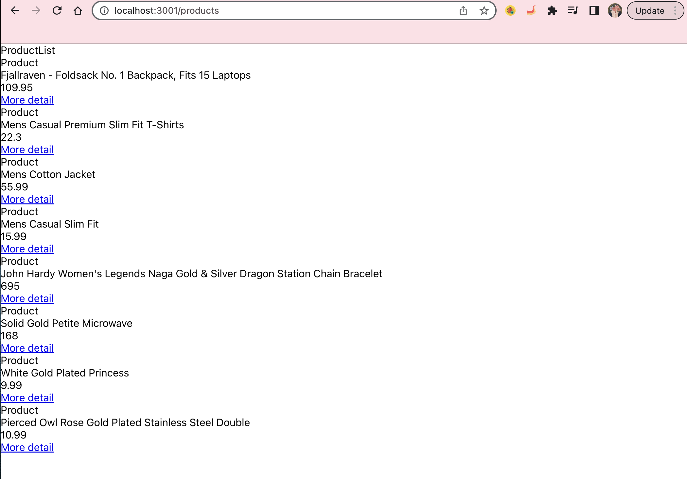
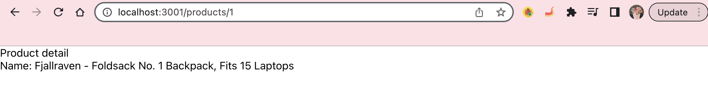

# React Routers

## How to run project

1. Step 1: yarn
2. Step 2: yarn start

## Requirements

1. Install the `react-router-dom` package
2. Add 4 pages: home, menu, products and product detail (nested route) with respective url. For example Home page should have url: `http://localhost:3000/`
3. Page menu, products and product detail should have `back` button to home page

## Screenshots

1. Page 1
   

2. Page 2
   

3. Page 3
   

4. Page 4
   
